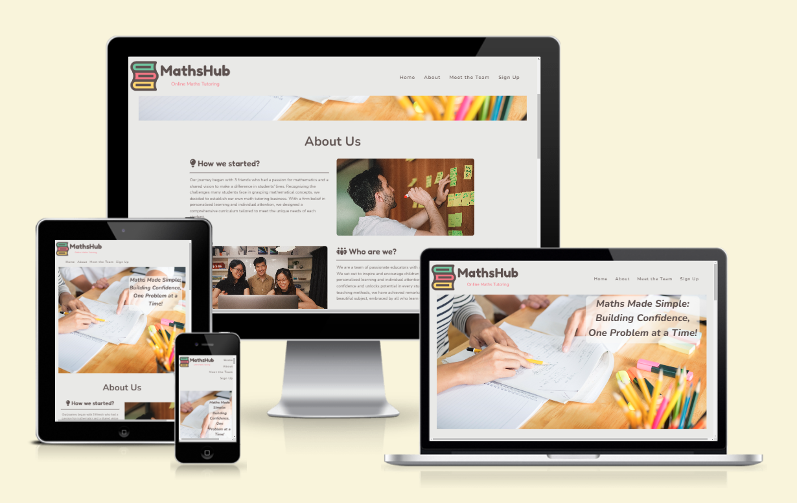
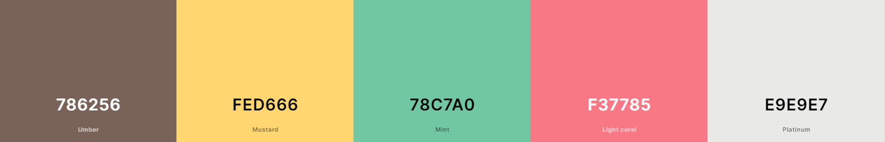

<h1 align="center">MathsHub</h1>

[View the live project here.](https://hhw1101.github.io/MathsHub/)

## **Table of Contents**
- [**Table of Contents**](#table-of-contents)
- [**Introduction**](#introduction)
- [**User Experience** (UX)](#user-experience-ux)
  - [Aim](#aim)
  - [User Stories](#user-stories)
- [**Design**](#design)
  - [Colour Scheme](#colour-scheme)
  - [Font](#font)
  - [Imagery](#imagery)
- [**Features**](#features)
  - [Existing Features](#existing-features)
  - [Future Features](#future-features)
- [**Technologies Used**](#technologies-used)
- [**Testing**](#testing)
- [**Credits**](#credits)
  - [Media](#media)
  - [Code](#code)

## **Introduction**

MathsHub is a fictional online tutoring service. The idea is inspired by a small business looking to expand further by having and online presence. The website is to introduce the idea of MathsHub further. Additionally, the website explains why MathsHub is a better option over other similar businesses.

## **User Experience** (UX)
### Aim
The aim of MathsHub is to help people who are of disadvantage help in maths through weekly online sessions. The website is to make a larger online presence for a small tutoring business, to gain more traction. This has key information about what happens at MathsHubs. 

The website encourages the user to sign up to the service or to ask more question.

### User Stories

 - First Time Visitor
    - 1. As a first time user, I want to know what is MathsHub.
    - 2. As a first time user, I want to know where is the meetings.
    - 3. As a first time user, I want to easily navigate the site to find information.
    - 4. As a first time user, I want to easily find social media pages.
  - Returning Visitor
    - 1. As a returning user, I want to be able to easily find sign up information.
    - 2. As a returning user, I want to easily contact for further questions.
    - 3. As a returning user, I want to read about case studies and facts about MathsHub.
  - Frequent Visitor
    - 1. As a freqeunt user, I want to be able to keep up to date with what is happening at MathsHub.
    - 2. As a freqeunt user, I want to easily 

## **Design**

 
### Colour Scheme  
 

The colour scheme used is based on the logo that was generated. This led to the main two colors being an off-white (#E9E9E7) and brown (#5d5250). The brighter colours in the logo are incorporated throughout the website in  small snippets.

### Font
Following the logo, the font to the website uses the main font for all the headings and a lighter font as the general text. The font is a softer font without sharp edges to be more appealing to a young audience and to not come across too harsh.

### Imagery 
The website was to follow a similar theme of the Code Institute sample website 'Love Running'. However the plan was to have an informative and easy to navigate website. The inital plan was to have multiple pages, however after some thought to make a more user friendly website I believed that a single page is easier to navigate.

## **Features**
### Existing Features
- Navigation Bar
  - The navigation bar contains the business Logo and the section names
  - The navigation bar is fixed at the top of the screen.
  - The navigation bar jumps to each section of the page except for the footer. 
- Landing page image with slogan
  - This introduces the atmosphere that the business is portraying. 
  - The image of work and a guiding hand, informs the user about the types of tutoring sessions that are offered.
- About us
  - This is a for further information about MathsHub
- Meet the Team
  - The Team portfolio is to introduce the team and who the students will be working with.
  - This is to allow potential users who sign up to see a familar face
- Sign up form
  - There are two pdfs that are for the user to fill in.
  - The pdfs open on a new tab, which can be downloaded.
- Footer
  - The footer contains a company logo and slogan
  - There are links to Social media accouts and a contact form to ask further questions.
### Future Features
- A tutor friendly version of the website in addition to the student version.
- A built in sign up form where you can the form changes depending on who needs the form.
- A carousel for the landing image, this is due to lack of photos to use.
- Having more team members and having a carousel of the profiles

## **Technologies Used**
- [HTML5](https://developer.mozilla.org/en-US/docs/Glossary/HTML5) 
- [CSS3](https://www.w3.org/Style/CSS/Overview.en.html#:~:text=Cascading%20Style%20Sheets%20(CSS)%20is,from%20the%20CSS%20working%20group.)
- [Github](https://github.com/) and [Git](https://git-scm.com/)
- [Font Awesome](https://fontawesome.com/)
- [Google Fonts](https://fonts.google.com/)
- [VSCode](https://code.visualstudio.com/)
- [W3Schools](https://www.w3schools.com/)
- [StackOverFlow](https://stackoverflow.com/)
  
## **Testing**

## **Credits**

### Media
In order of apperance
 - [logo](assets/img/logo.png) - Image generated using [freelogodesign.org](https://freelogodesign.org)
 - [tutoring](assets/img/home/tutoring.jpg) - Image from [qca.org.uk](https://www.qca.org.uk/top-online-tutoring-platforms-uk.html)
 - [brainstorming](assets/img/about/brainstorming.jpg) - Image by [Lala Azizil](https://unsplash.com/@lazizli) on [Unsplash](https://unsplash.com/)
 - [people](assets/img/about/people.jpg) - Image by [Barney Yau](https://unsplash.com/@barneyyau) on [Unsplash](https://unsplash.com/)
 - [teaching](assets/img/about/teaching.jpg) - Image by [ThisisEngineering RAEng](https://unsplash.com/@thisisengineering) on [Unsplash](https://unsplash.com/)
 - [photo1](assets/img/meet-the-team/photo1.jpg) - Image by [Jack Nackos](https://unsplash.com/@jakenackos) on [Unsplash](https://unsplash.com/)
 - [photo2](assets/img/meet-the-team/photo1.jpg) - Image by [Nicolas Horn](https://unsplash.com/@sysengineer) on [Unsplash](https://unsplash.com/)
 -  [photo3](assets/img/meet-the-team/photo1.jpg) - Image by [Vicky Hladynets](https://unsplash.com/@vhladynets) on [Unsplash](https://unsplash.com/)
 -  [sign-up-photo](assets/img/sign-up/sign-up-photo.jpg) - Image by [Samantha Borges](https://unsplash.com/@samich_18) on [Unsplash](https://unsplash.com/)
 -  [pdf-icon](assets/img/sign-up/pdf-icon.png) - Image taken from [commons.wikimedia.org](https://commons.wikimedia.org/)

### Code
[MathsHub](https://github.com/hhw1101/MathsHub) is based on my own implementation of code, using what I had learned in the [Code Institute Web Developer Course](https://codeinstitute.net/).

Inspiration was taken from [Code Institute Love Running](https://github.com/Code-Institute-Org/love-running-2.0)

